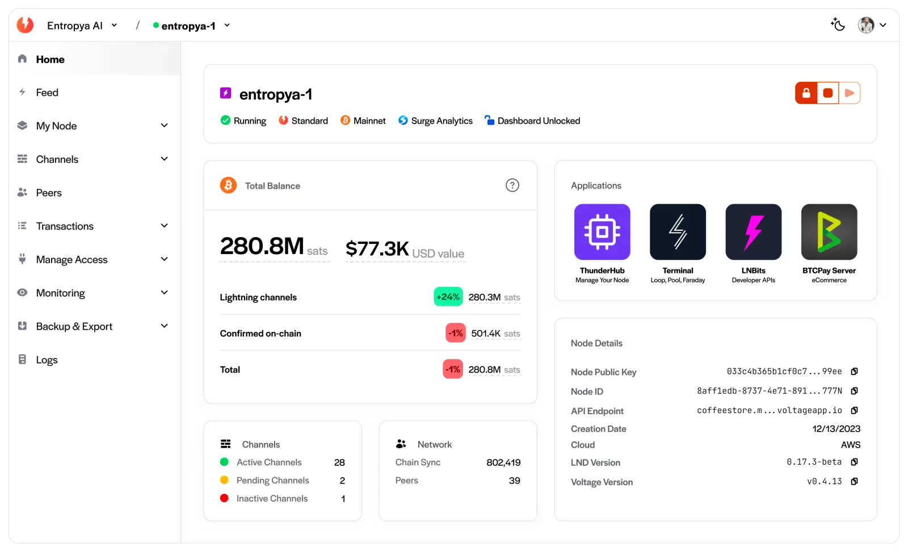
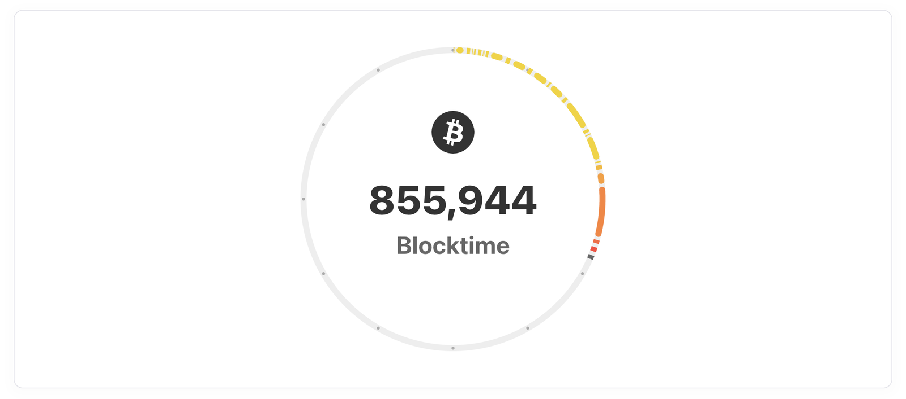
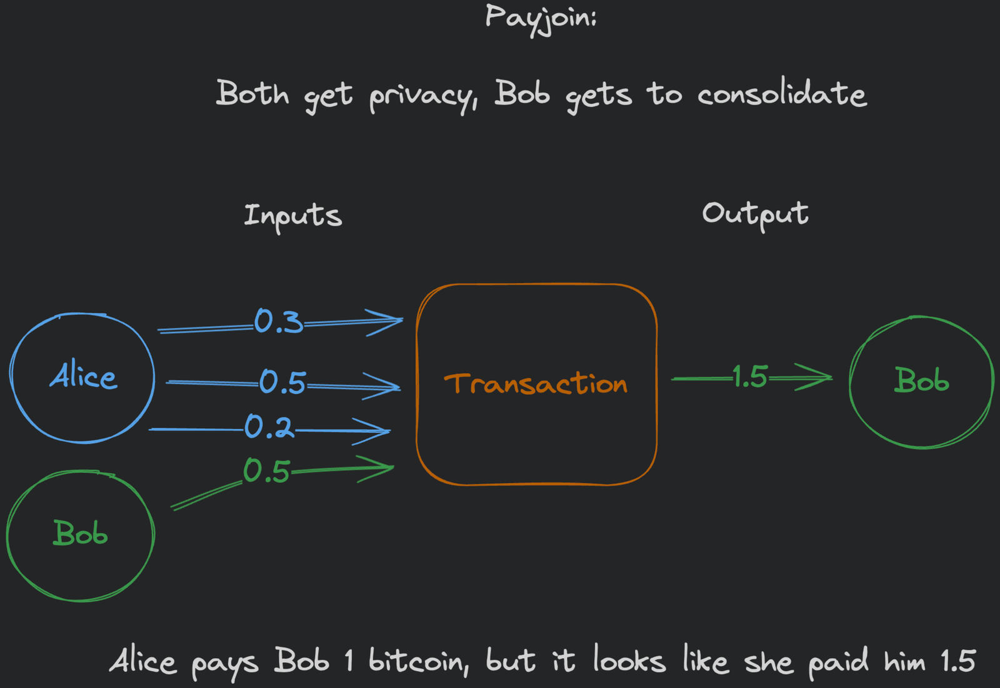
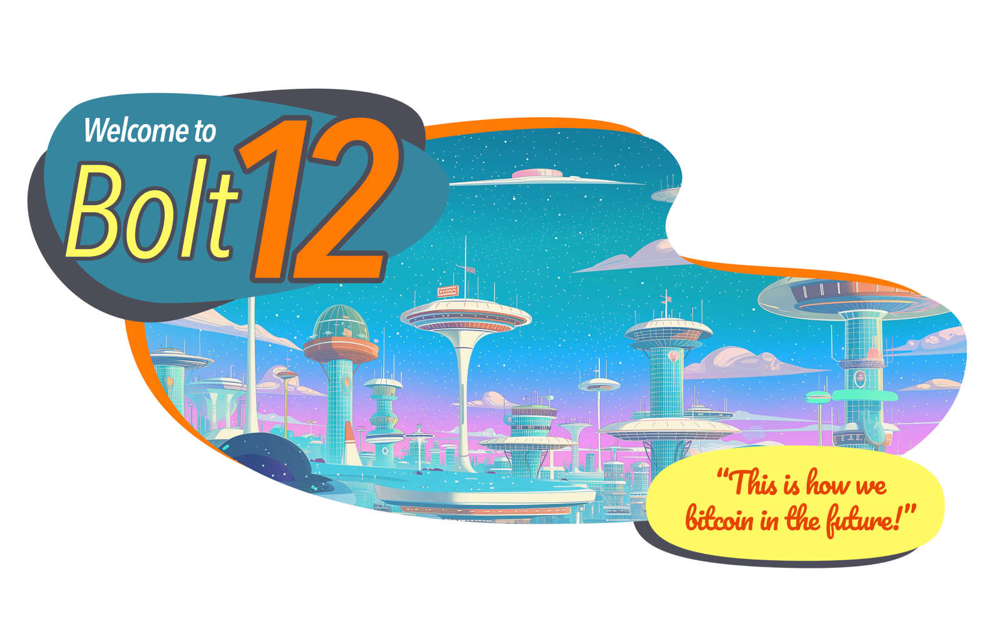
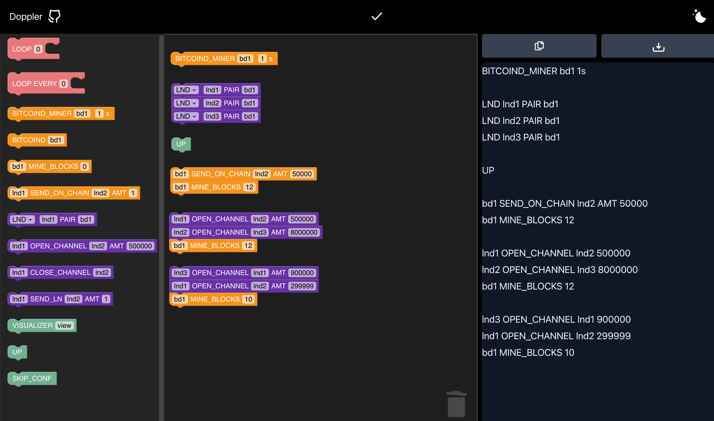
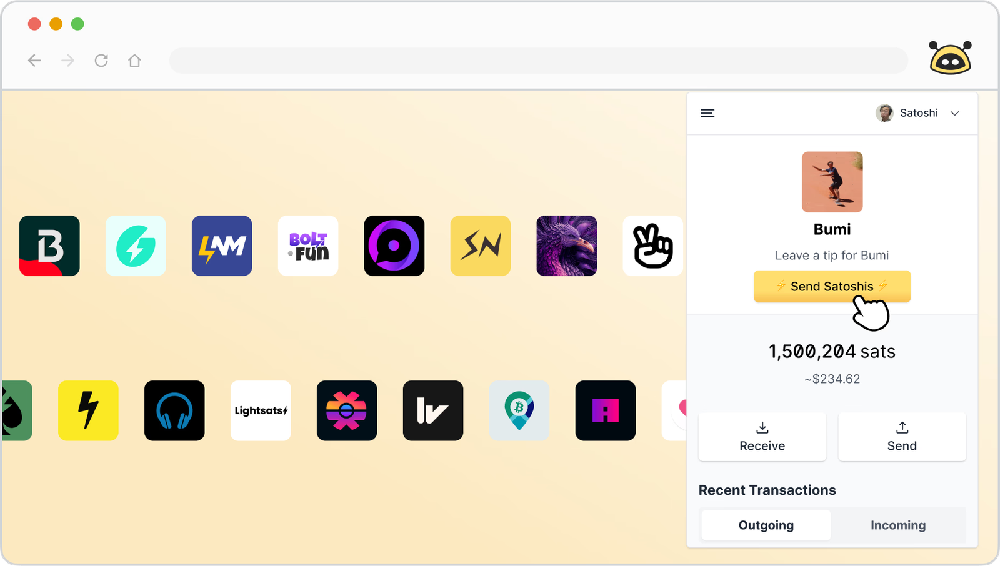
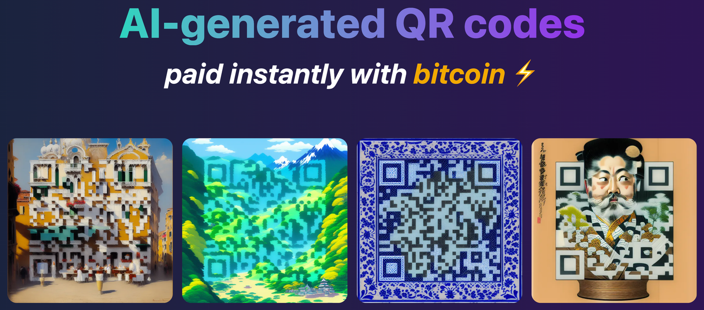
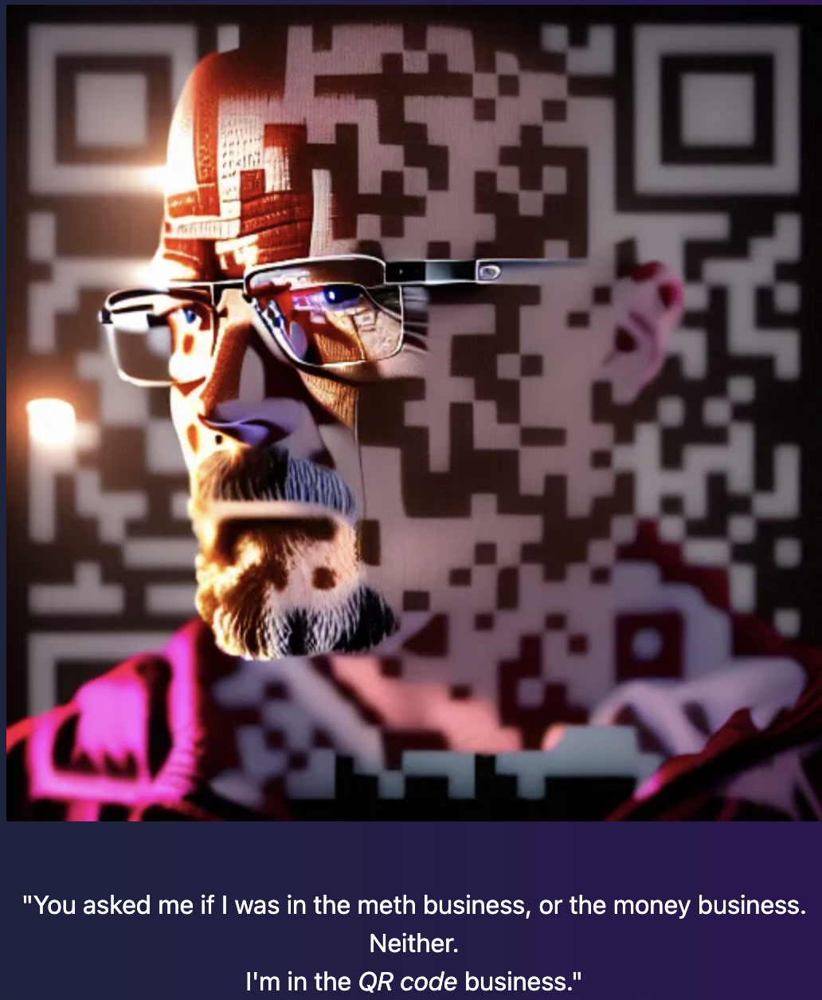

+++
template = "page.html"
title = "Projects"
+++

I work at [Voltage](https://voltage.cloud), to whom I am very grateful for cultivating a culture of giving back to the community through open source development via [FOSS Fridays](https://voltage.cloud/blog/foss-friday/foss-fridays-at-voltage). It has enabled me to connect more broadly with the Bitcoin community and expand my skills as a software engineer. It's a great team on a great [mission](https://voltage.cloud/about); the spirit of [definite optimism](https://boxkitemachine.net/posts/zero-to-one-peter-thiel-definite-vs-indefinite-thinking) is alive and well here.

I have many abandoned projects and dead-end, experimental repos on [Github](https://github.com/thebrandonlucas?tab=repositories) (sorry about that!). However, here are some projects that I'm particularly proud of contributing to.

---

## [Voltage](https://www.voltage.cloud)

I'm on the frontend engineering team at Voltage. We make it easy to run Bitcoin and Lightning infrastructure. If you've interacted with our product at all from the browser, chances are I worked on it!

---

## [Block Clock](https://github.com/voltagecloud/block-clock)

The frontend and design team at Voltage built this `block-clock` web component that connects to Bitcoin Core to display the distribution of block times in a standard 12-hour clock face, using the beautiful designs from the [Bitcoin Core App](https://bitcoincore.app/?ref=blucas.ghost.iohttps://bitcoincore.app) project to do it. We use it in our own [Bitcoin Core Nodes](https://www.voltage.cloud/bitcoin-core) product, but we wanted to make this something that could be shared with the community. We built it as a web component so it's easy to run it in any browser environment, whether you're using frameworks like React or Sveltekit, or just want to drop it directly into an HTML page. If you have a Bitcoin Core node, give it a try!

Check out the [Github Repo](https://github.com/voltagecloud/block-clock) or watch our discussion with the [Bitcoin Design Community](https://www.youtube.com/watch?v=igKZ-IPlADY) to see how it works!

---

## [Payjoin](https://payjoin.org)

Payjoin is a protocol designed to assist bitcoin scaling, help save fees, and preserve privacy, whose adoption by even a small minority of wallets could have dramatically positive effects for all bitcoin users.

I built the current version of [payjoin.org](https://payjoin.org) with help from [Dan Gould](https://dangould.dev). I'm also contributing to [Payjoin Dev Kit (PDK)](https://dangould.dev), a tiny library that helps wallets integrate Payjoin, and includes a reference implementation, `payjoin-cli`, that showcases its features.

---

## [Bitcoin QR Web Component: `bitcoin-qr`](https://bitcoin-qr-demo.netlify.app)

_Add your company's image and style the QR to match!_

I created a [web component](https://developer.mozilla.org/en-US/docs/Web/API/Web_Components) to make it easy to create BIP 21 compatible QR codes with a lot of developer-and-user-friendly defaults. One problem I consistently ran into when developing lightning applications was having to repeatedly build a QR code component with HTTP polling to check for payment, in addition to making many UX decisions about when to use BIP 21 for `bitcoin:` and `lightning:` URI prefixes and how to handle query params. Additionally, I found myself reimplementing a component that did all this in each framework (i.e. React, Svelte) I was using. As far as I know, everyone who's building UIs in bitcoin has to keep redoing this work.

I decided it would be valuable (to myself, if nobody else) to build a universal web component that came with all this functionality out of the box with maximum configuration but opinionated defaults, that could be used in any [framework](https://qr-code-styling.com) or in pure HTML. And for extra fun, it's built on a framework that allows a lot of styling customization!

Feedback on this would be very much appreciated, please feel free to [open an issue](https://github.com/thebrandonlucas/bitcoin-qr) if you find a problem or have any suggestions for improvement!

---

## [bolt12.org](https://bolt12.org)

BOLT 12 is a specification for implementing offers, which massively improves the lightning user experience by making QR codes:

- Reusable
- Smaller
- Capable of sending you money, like an ATM, as well as receiving

It generates these QRs in-band, as opposed to the out-of-band [LNURL](https://voltage.cloud/blog/lightning-network-faq/how-does-lnurl-work-enhancing-lightnings-user-experience) format, which requires a web server that generates invoices on behalf of your lightning node and is essentially a "hack" on previous limitations of lightning. We can make huge improvements to both the developer and user experience by adopting BOLT 12, and this website hopes to encourage its adoption.

I collaborated with master designer [@sbddesign](https://x.com/StephenDeLorme) to build the current version of bolt12.org.

---

## [Doppler](https://github.com/tee8z/doppler)

Doppler is a Domain-Specific Language (DSL) created by [@tee8z](https://x.com/Tee8z) that allows you to write reusable scripts to create local [regtest](https://developer.bitcoin.org/examples/testing.html) (and [Mutinynet](https://blog.mutinywallet.com/mutinynet)!) environments in any configuration you like. The scripts allow for easy reproducibility of any scenario you can think of and dramatically expands the possibilities for testing bitcoin and lightning applications, improving on one of the main limitations of testing software like [Polar](https://lightningpolar.com) (also a great project).

Alongside [@tee8z](https://x.com/Tee8z), I built the first iteration of the frontend that allows you to visualize and build scripts using the Scratch block programming language.

---

## [Satogram](https://satogram.xyz)

Wouldn't it be nice to get paid to see ads, instead of today, where your data is harvested for profit and you get barraged with internet-polluting ads?

Satogram is a project that advertisers can use to pay to send ads over the Lightning Network. It's like spam email, except you're getting paid!

Satogram came out of a hackathon project at Tabconf 2023 led by [@BitcoinCoderBob](https://x.com/BitcoinCoderBob). I built the frontend at the hackathon. As of this writing, Satogram has been used to send a total of 1,515,896 advertisements!

---

## [Alby](https://getalby.com)

Alby is a popular lighting wallet browser extension that comes with a wide variety of innovative features. In my first real contributions to open source, I helped build the internationalization flow to allow the app to be translated to a variety of different languages. I also added the ability to [connect and make payments via signets such as Mutinynet](https://github.com/getAlby/lightning-browser-extension/pull/3128), to allow for easier testing of web applications with [WebLN](https://webln.guide). Thanks to the Alby team for taking the time to help me contribute to open source bitcoin in the first place, kicking off this crazy exciting adventure.

---

## [QRty](https://qr-ai.netlify.app)

This project used [stable diffusion](https://en.wikipedia.org/wiki/Stable_Diffusion) to generate artistic QR codes based on a prompt. Since the only options to generate these QR codes at the time were through subscription services, we thought it would be nice if people could make small payments per query with bitcoin (an idea [obviously befitting to AI services](https://hivemind.vc/ai) in general, but for whatever reason this idea hasn't broken through past us in the bitcoin bubble to mainstream consciousness yet).

It's no longer active due to relatively low use, but we were really proud of the result and you can still see some examples of scan-able codes we created on the site and in these Twitter posts. Built on Voltage with my friend [@LightningK0ala](https://x.com/LightningK0ala).

_I wish I'd saved the prompt that generated this._
